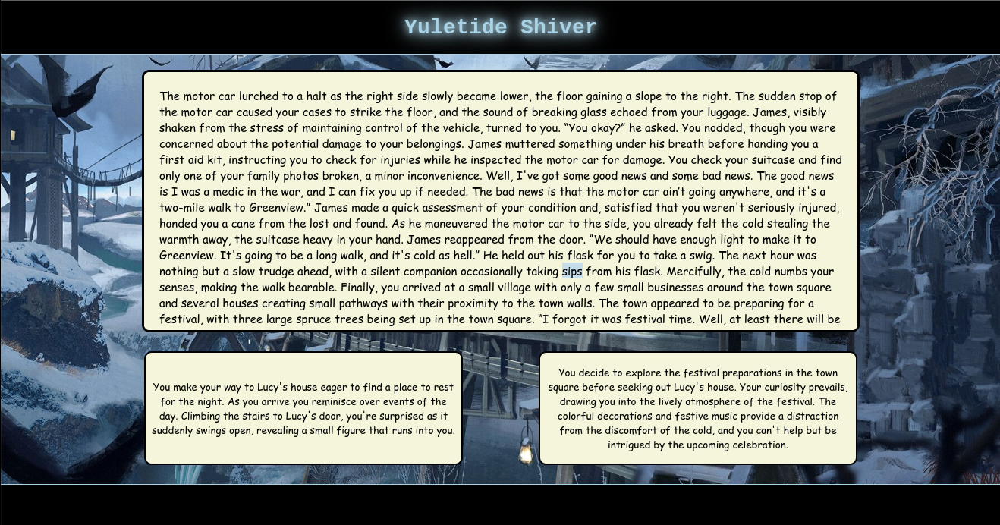

# Yuletide Shiver - A Choose Your Own Adventure Story
Welcome to Yuletide Shiver, a choose your own adventure story! This project is the result of a one week Hack Sprint at Holberton Tulsa.

You hail from a small town in frozen New England, but opportunity has come knocking. A new job offer means it's time to leave the place you've called home. You'll have to make a stopover in Greenwood as the journey is long. Surely it won't be too much of a hassle...

## Accessing the Site
[Yuletide Shiver](https://hacksprint-2023-6d4cc.web.app/)

## Table of Contents
* [Infrastructure](#Infrastructure)
* [Example](#Example)
* [Instructions](#Instructions)
* [Retrospective/Stretch-Goals](#Retrospective/Stretch-Goals)
* [Authors](#authors)
* [Citations](#citations)

## Infrastructure
This project is hosted on FireBase using the FireBase SDK. HTML, CSS, and JavaScript are used for the Front-End, and JavaScript is used in conjunction with FireBase/FireStore for the Back-End.

## Example

## Instructions
To enjoy our choose your own adventure story, simply select the link above under [Accessing the Site](#accessing-the-site). Once there, read through each story prompt and decide what you want to do next!

## Retrospective/Stretch-Goals
The theme for our one week Hack Sprint was "Winter". After some initial brainstorming, we landed on a choose your own adventure story. During the course of the project, we ultimately decided to switch from a back-end running MySQL/Flask, to one run primarily on FireBase. The only two major hurdles we found ourselves facing involved tracking/accessing our data stored in FireStore, and learning how module/package bundling works in JavaScript.

If we had more time, the following features were next in line to be implemented:
* Implementing hotkeys for choice selection
* Expanding the story, adding endings, and randomizing story pathing
* Implementing a story progress bar
* Implementing a save feature
* Adding a settings menu

## Authors
Christopher Stephens - [Github](https://github.com/Jtownokie)  
Lee West - [Github](https://github.com/LeeWest89)  
Parker Moore - [Github](https://github.com/cpmoore0317)

## Citations
[Site Background Image/README Cover Image - sla jeong](https://monsterdrawing7.artstation.com/projects/0X61Ke)
